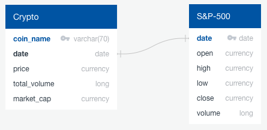
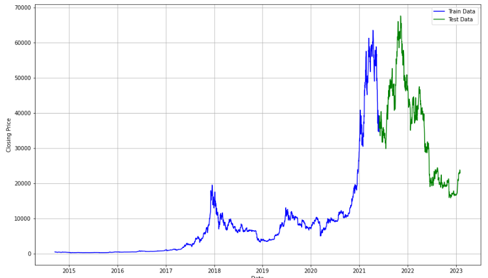
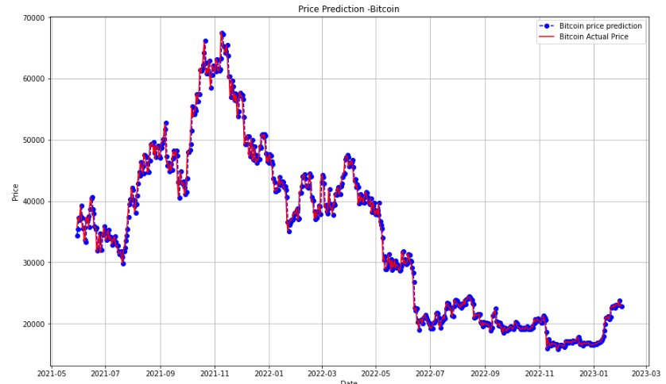
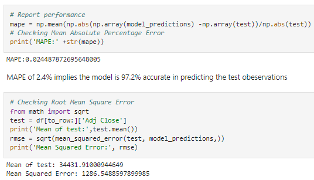
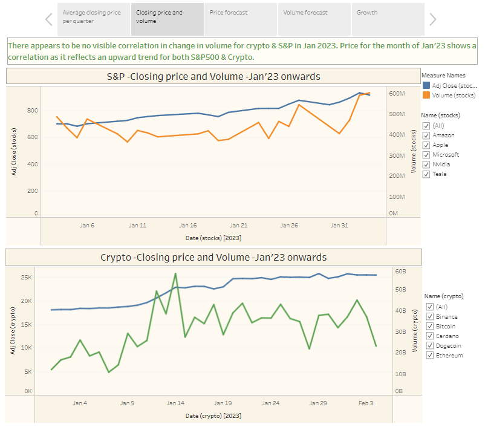
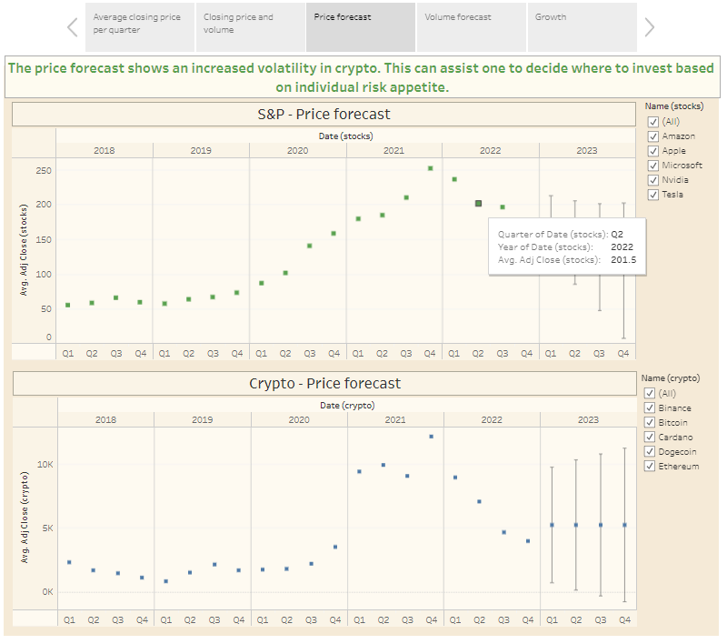

# Group 6 Final Project:  Cryptocurrency vs S&P 500 Analysis
Use machine learning, Python, PostgreSQL and Tableau to analyze and predict top 5 cryptocurrencies with top 5 S&P 500.  

*Team - Fareena Mughal, Emerset Farquharson, Kirti Henry, Hitha Das*

## Links to Project Dashboard & Presentation
[Here is the link to our Tableau Workbook](https://public.tableau.com/app/profile/fareena.mughal/viz/Group-6-Crypto-rev1/Group-6-Crypto_1)  
[Here is the link to our Final Presentation](https://docs.google.com/presentation/d/1yCBFztSsGj-3OpqkgikMw2RJheAqAW3HfePbhYNX_KQ/edit?usp=sharing)

## Overview 
Cryptocurrency, specifically Bitcoin, has seen a tremendous amount of growth in recent years, with many investors turning to it as an alternative to traditional investments like stocks. In this project, we will compare the performance of top 5 S&P 500, a stock market index that represents the performance of the top 500 publicly traded companies in the United States, to that of top 5 cryptocurrencies. 

The 5 cryptocurrencies used in this analysis are - 
1. Bitcoin (BTC) 
2. Ethererm (ETH)
3. Binance coin (BNB)
4. Cardano (ADA)
5. Dogecoin (DOGE)

The 5 S&P 500 used in the analysis are -
1. Apple Inc. (AAPL)
2. Microsoft Corp. (MSFT)
3. Amazon.com, Inc. ( AMZN)
4. Tesla, Inc. (TSLA)
5. Nvidia Corp. (NVDA)

We will use historical data on the prices of the top 5 cryptocurrencies and the top 5 companies in the S&P 500 to predict the future prices and volatility for the following days. Standard deviation will be used as a measure of volatility and compare the results between the two asset classes. We will also use charts to visually represent the volatility and the price predictions of each asset over time.

## Purpose of the Project
The purpose of this analysis is to predict future prices of the top 5 cryptocurrencies and thatt of the top 5 companies in the S&P500 using a Machine Learning model, as well as showing volalitity . Cryptocurrencies have gained popularity in recent years as an alternative investment option to traditional stocks. This analysis aims to evaluate the risk and potential returns of investing in these two different asset classes.

## Resources
Below are the links to the datasets we used, sourced from Yahoo Finance:  
[S&P 500](https://finance.yahoo.com/quote/%5EGSPC/history?p=%5EGSPC) | 
[ADA](https://finance.yahoo.com/quote/ADA-USD?p=ADA-USD&.tsrc=fin-srch) | 
[BNB](https://finance.yahoo.com/quote/BNB-USD?p=BNB-USD&.tsrc=fin-srch) | 
[BTC](https://finance.yahoo.com/quote/BTC-USD?p=BTC-USD&.tsrc=fin-srch) | 
[DOGECOIN](https://finance.yahoo.com/quote/DOGE-USD?p=DOGE-USD&.tsrc=fin-srch) | 
[ETH](https://finance.yahoo.com/quote/ETH-USD?p=ETH-USD&.tsrc=fin-srch)

## Tool used in our project
In our group project we are using the following technology and tools:

* **Data Preprocessing**: Google Colab, Jupyter Notebook, Python
* **Data Storage**: PostgreSQL
* **Machine Learning**: ARIMA, TensorFlow, Keras, Long Short-Term Memory Model (LSTM)
* **Presentation**: Tableau, Google Slides, Quick DBD

## Steps
- Source data (Yahoo Finance)
- Scraped/ cleaned/ created csv dataset and associated tables
- Query data using Python/Jupyter Notebook
- Store the data on a database (we used PostgreSQL & Tableau Cloud)
- Used machine learning (time series regression model) for prediction
- Connect to cleaned CSVs using Tableau Desktop and published on Tableau Public
- Analysis
- Visualization & story-telling

## Segment 1
#### <ins>A description of the data</ins>  
After extracting the each of the 5 crypto datasets from Yahoo Finance using Python, we appended a column called "Name" that contains the name of the coin/ETF. This step was necessary as we concatenated the datasets into one master file, keeping the S&P 500 data in a separate one. 

ERD 

 

Here are some snapshots of our 2 datasets, as dataframes:  

1. Crypto Dataframe  
 
2. S&P 500 Dataframe  

After changing the datatypes of the columns e.g. changing the "Date" column to a DateTime type, "Open" to float etc, we provided a quick summary of each dataset, as shown below:

1. Crypto Summary  
 
2. S&P 500 Summary  

We exported both dataframes as CSV files, that we used pgAdmin to store the data in 2 tables created with respective datatypes, shown below:
1. Crypto Table  
 
2. S&P 500 Table  

#### <ins>Questions we plan to answer with the project</ins>  
1. Using a calculated measurement like Volatility, we want to show how high or low risk the stocks are.
2. Is there any correlation based on the visualizations made between the stock market and cryptocurrencies?
3. Using a regression machine learning model, we want to predict the prices of crypto or stock in the next X time.

## Dashboard
We will utilize Tableau  to present data in the form of graphs, charts, and a narrative format, with different interactive functionality to the users to filter through.

Following are some sample charts with metrics and visualizations we aim to show in our final presentation -

## Segment 2

#### <ins>Working end to end Machine Learning Analysis</ins>  

## ARIMA MACHINE LEARNING MODEL
After some exploratory work with the dataset, we decided to use the [ARIMA Machine Learning model on our datasets to predict future prices](https://github.com/fareenamughal/Group-6-Crypto/tree/main/Code/Machine%20learning). Our team made use of both Jupyter notebook and Google Colab for this project. We also decided to use a larger dataset with data since September 2014 for more datapoints for our model to train itself on.  

Applying the ARIMA model on each dataset, we could make predictions on the price for the following day, while splitting our training and test set to a 80/20 ratio. Below is an example of the training vs testing datasets for BTC:  

  

  

We also used the ARIMA model to predict Volatility of our stocks.
[arima-volatility-1](Images/ARIMA-volatility-1.png)
[arima-volatility-2](Images/ARIMA-volatility-2.png)

## LSTM MACHINE LEARNING MODEL
Hoping for an improved model, we decided to use the LSTM Deep Learning machine learning on our dataset for the same purpose; predicting future close prices. We used the train-test-split method, trained the model to predict the close prices for the next 30 days.

[lstm-viz1](Images/Visualization-Final-LSTM-AMZ.PNG)
[lstm-viz2](Images/Visualization-Final-LSTM-BNB.PNG)

## Results
Using the Mean Absolute Percentage Error (MAPE), our ARIMA model precision averages to about 97.87% for the top 5 S&P500 stocks, and 96.98% for the top cryptocurrencies.

 

#### <ins>Tableau Visualizations</ins>  
We started adding some informative charts to add to our story-telling element of our project. [Link to our Tableau Visualization](https://public.tableau.com/app/profile/fareena.mughal/viz/Group-6-Crypto-rev1/Group-6-Crypto_1)

Below are some screenshots from our version 1 of our Tableau visualization:

## Segment 3
In segment 3, we focused on building our final presentation content and visualization.  

Following are some screenshots from the final version of our [Tableau workbook](https://public.tableau.com/app/profile/fareena.mughal/viz/Group-6-Crypto-rev1/Group-6-Crypto_1); each dashboard contains a story based on the charts, detailing our observations on the dataset. Also added are user functionalities like filtering options and charts information overlay.  

#### <ins>Alternatives we could have considered in this project</ins>  
Our Machine Learning models does not take independent external factors in consideration like the news e.g. Ukraine/Russia war, the Government covid aid; nor does it take into account internal factors like seasonality.

#### <ins>Potential improvements for future work</ins>
* Analyse and visualize pre and post covid data
* Develop custom portfolio prediction templates
* Automating alerts for significant changes
* Provide insights for investment decisions, based on individual risk profiles
* Incorporating volatility as a key factor in risk assessments

## References
* [Kaggle Datasets](https://www.kaggle.com/datasets/sudalairajkumar/cryptocurrency-historical-prices-coingecko)
* [Yahoo Finance](https://ca.finance.yahoo.com/)
* ARIMA Machine Learning Model
  * [Link 1](https://www.investopedia.com/terms/a/autoregressive-integrated-moving-average-arima.asp#:~:text=An%20autoregressive%20integrated%20moving%20average%2C%20or%20ARIMA%2C%20is%20a%20statistical,values%20based%20on%20past%20values.)
  * [Link 2](https://otexts.com/fpp2/arima.html)
  * [Link 3](https://machinelearningmastery.com/arima-for-time-series-forecasting-with-python/)
  * [Link 4](https://www.oreilly.com/library/view/machine-learning-for/9781492085249/ch04.html)
  * [Link 5](https://www.investopedia.com/terms/v/volatility.asp)
  * [Link 6](https://www.learnpythonwithrune.org/calculate-the-volatility-of-historic-stock-prices-with-pandas-and-python/)
* LSTM Machine Learning Model
  * [Link 1](https://towardsdatascience.com/cryptocurrency-price-prediction-using-lstms-tensorflow-for-hackers-part-iii-264fcdbccd3f)
  * [Link 2](https://medium.com/geekculture/lstm-for-bitcoin-prediction-in-python-6e2ea7b1e4e4)
  * [Link 3](https://www.kaggle.com/code/meetnagadia/bitcoin-price-prediction-using-lstm)
  * [Link 4](https://www.analyticsvidhya.com/blog/2021/05/bitcoin-price-prediction-using-recurrent-neural-networks-and-lstm/)
  * [Link 5](https://machinelearningmastery.com/lstms-with-python/#:~:text=The%20Long%20Short%2DTerm%20Memory%2C%20or%20LSTM%2C%20network%20is,of%20loops%20to%20the%20architecture.)

## Link to Final Presentation
[Follow this link](https://docs.google.com/presentation/d/1yCBFztSsGj-3OpqkgikMw2RJheAqAW3HfePbhYNX_KQ/edit?usp=sharing) to view our final presentation on Google Slides.

